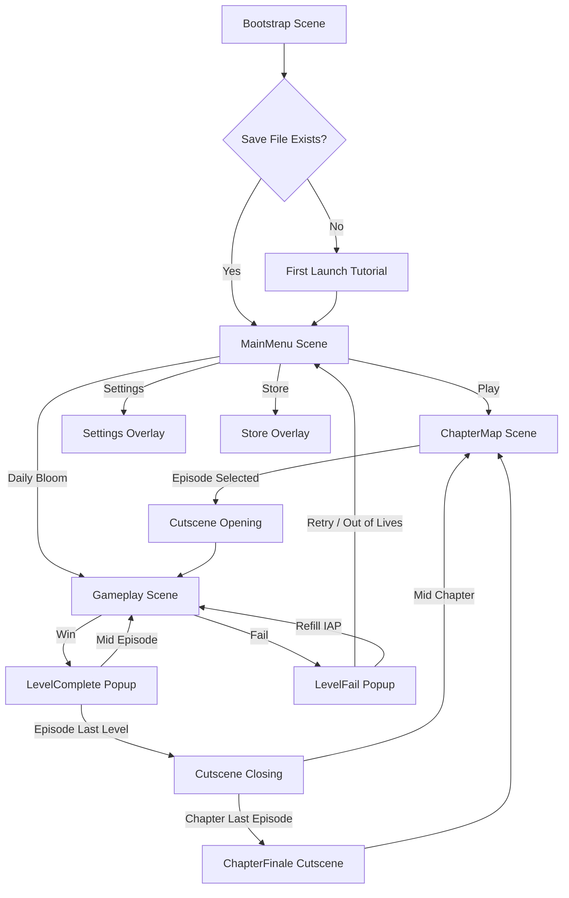
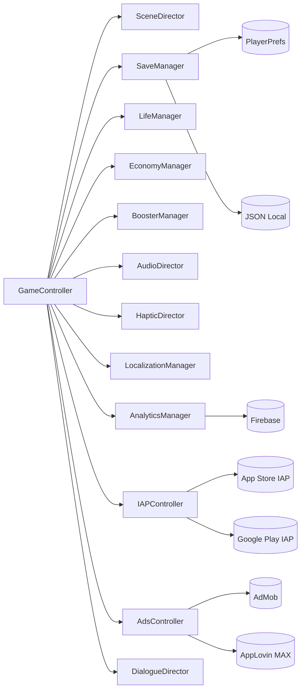
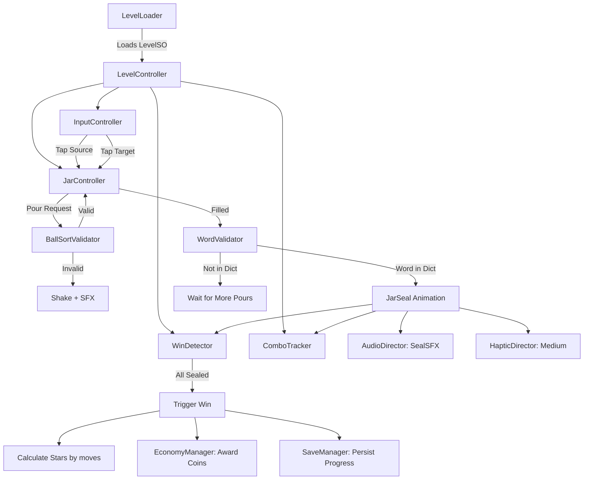
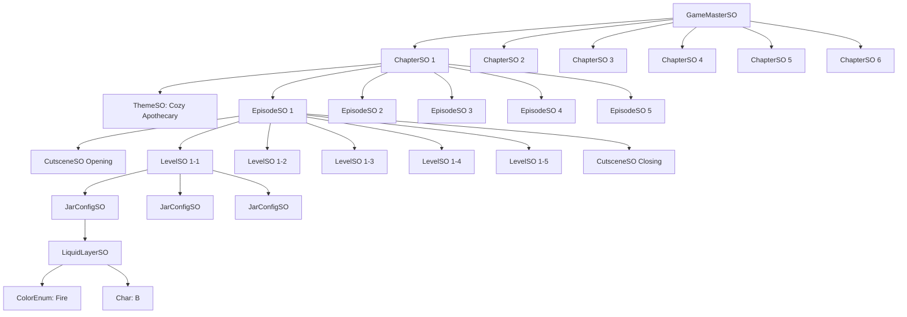
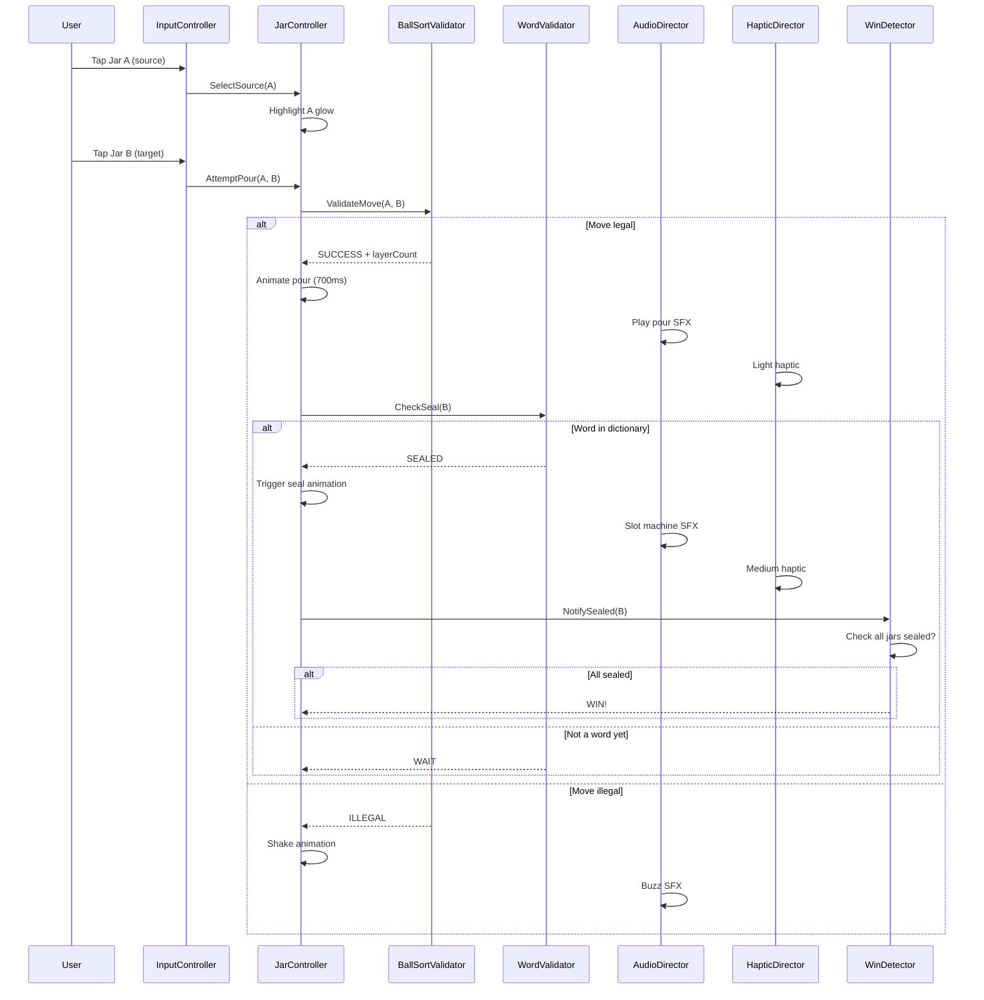
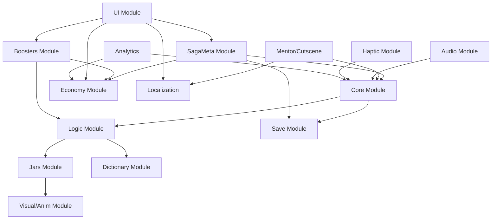
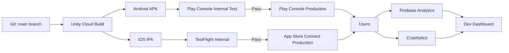

# 🏗️ Unity Scene & System Architecture

**Belge amacı**: POURLE Unity projesinin sahne akışı, manager singleton katmanı, data flow.

---

## 1. Scene Flow (Top Level)



---

## 2. Singleton Manager Layer (DontDestroyOnLoad)



---

## 3. Gameplay Scene — System Detail



---

## 4. ScriptableObject Data Hierarchy



---

## 5. Save Data Schema

```json
{
  "playerProfile": {
    "playerId": "uuid",
    "createdAt": "2026-04-28T10:00:00Z",
    "currentChapter": 2,
    "currentEpisode": 6,
    "currentLevel": 3,
    "totalStars": 47,
    "totalCoins": 1240
  },
  "lifeState": {
    "currentLives": 4,
    "lastRefillTimestamp": 1714312345,
    "infiniteLivesUntil": null
  },
  "boosterInventory": {
    "hint": 5,
    "extraJar": 3,
    "undo": 12,
    "autoSort": 2,
    "heat": 1,
    "coolMist": 0
  },
  "purchases": {
    "noAds": false,
    "starterPack": true,
    "witchPassActive": true,
    "witchPassExpires": 1716904345,
    "themesOwned": ["frozen", "volcano"]
  },
  "levelProgress": [
    {"levelId": "1-1", "stars": 3, "completedAt": 1714000000, "bestMoves": 6},
    {"levelId": "1-2", "stars": 2, "completedAt": 1714001000, "bestMoves": 9}
  ],
  "settings": {
    "language": "tr",
    "musicVolume": 0.7,
    "sfxVolume": 1.0,
    "hapticEnabled": true,
    "notificationsEnabled": true
  }
}
```

---

## 6. Pour Algoritma Sequence



---

## 7. Module Dependency Graph



---

## 8. Build Pipeline



---

## 9. Performans Profiling Hedefleri

| Metrik | Hedef | Tool |
|---|---|---|
| FPS (mid-range Android) | 60 | Unity Profiler |
| RAM (peak) | <300 MB | Memory Profiler |
| Build size | <150 MB | Build Report |
| Cold start time | <2 sn | Firebase Performance |
| Scene load (Gameplay) | <1 sn | Unity Profiler |
| Crash-free rate | %99.5+ | Crashlytics |

---

## 10. CI/CD Strategy

- **main branch**: production-ready code
- **dev branch**: active development
- **feature/X branches**: isolated work
- Unity Cloud Build her commit'te otomatik APK + IPA üretir
- TestFlight + Play Console internal track auto-deploy
- Production deploy manuel onay (her hafta)

---

*Sürüm 1.0 — design freeze referansı.*
