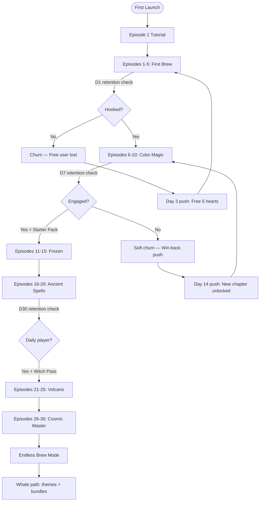
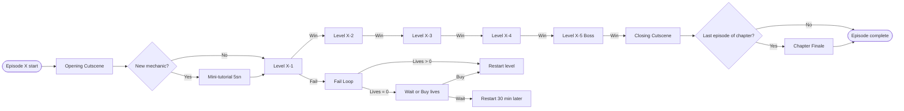
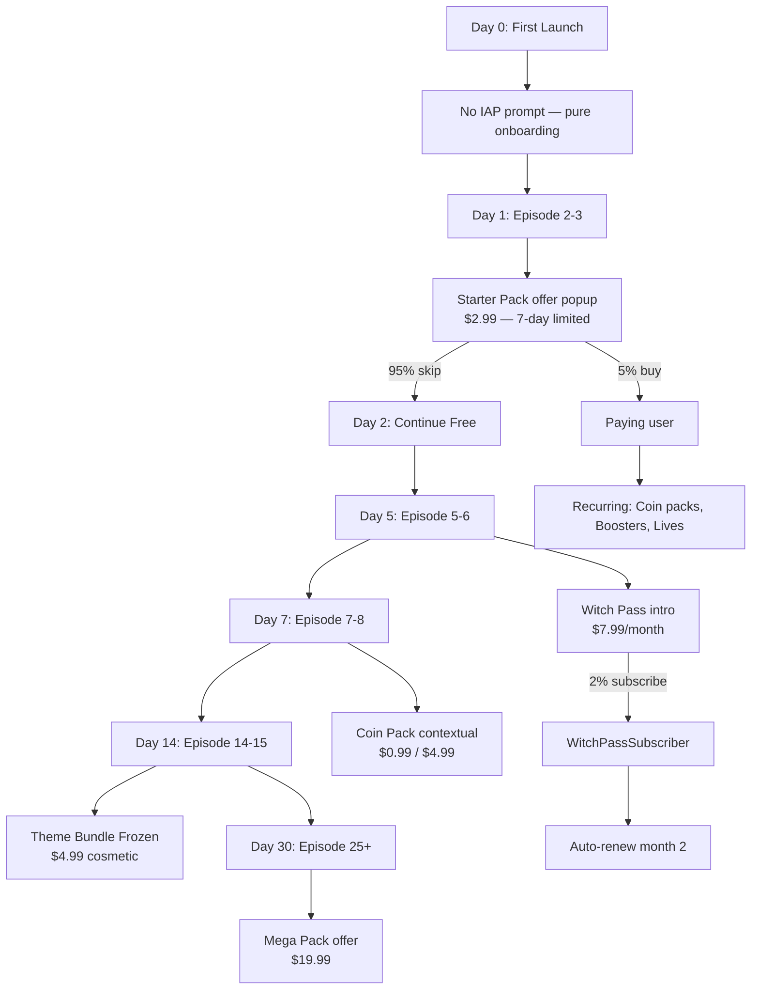
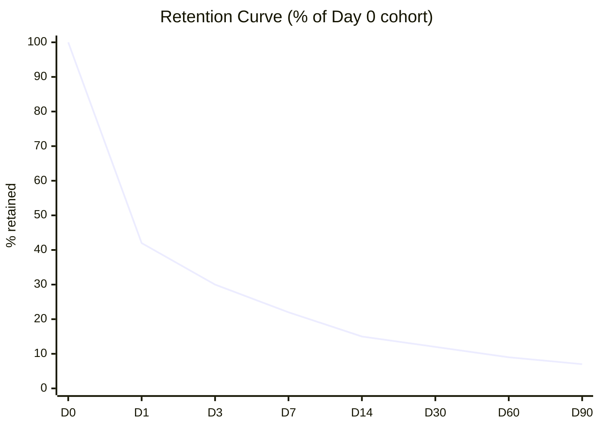
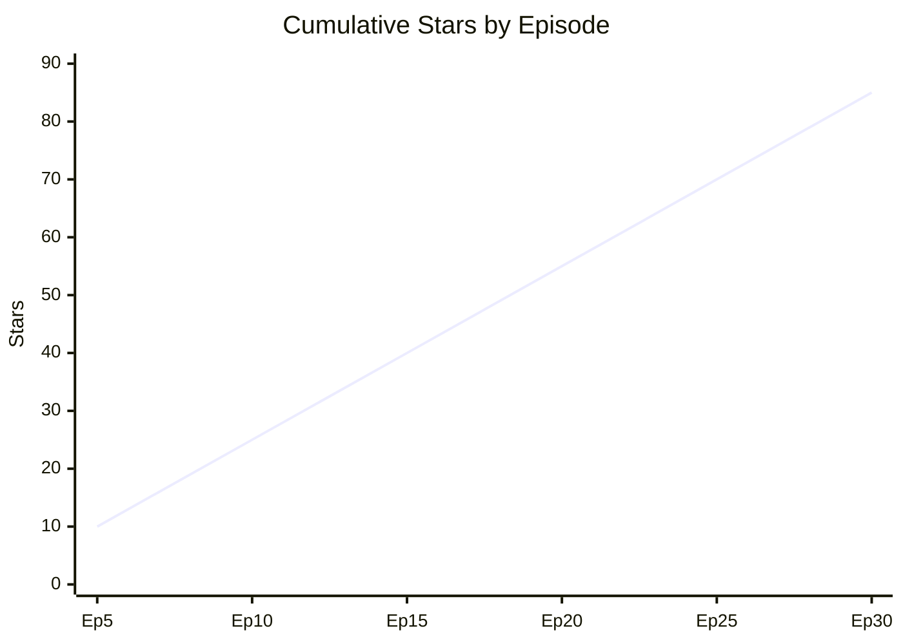
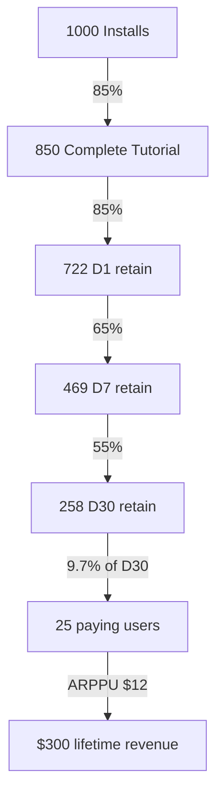
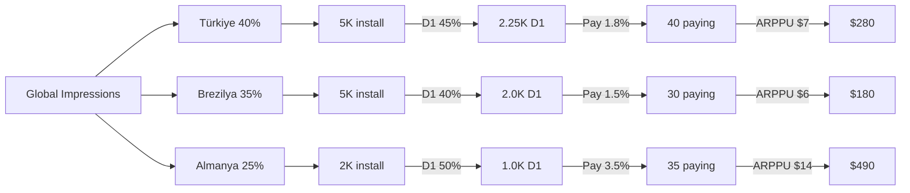
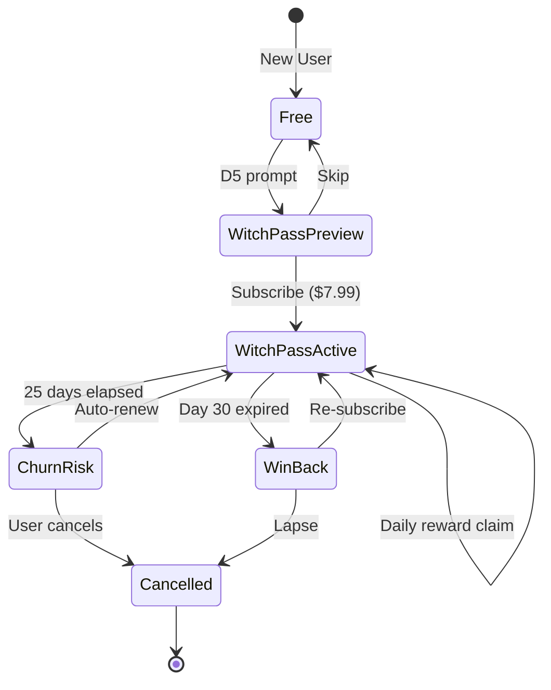

# 📈 Chapter Flow Diagram (Player Progression)

**Belge amacı**: Oyuncunun 30 episode boyunca journey haritası — mekanik açılış, story beat, monetization touchpoint senkronu.

---

## 1. Yüksek-Düzey Player Journey

---

## 2. Episode Detail Flow

---

## 3. Mekanik Açılış Timeline

```mermaid
gantt
    title Mekanik Evrim — 30 Episode
    dateFormat X
    axisFormat %s

    section Chapter 1
    Core Ball Sort + Wordle      :done, ep1, 0, 1
    4-jar challenge              :done, ep3, 2, 1
    5th Element (Aether)         :done, ep4, 3, 1

    section Chapter 2
    Color Transform              :active, ep6, 5, 1
    Locked Caps                  :active, ep8, 7, 1

    section Chapter 3
    Frozen Bottle                :ep11, 10, 1
    Heat Booster                 :ep12, 11, 1
    Speed Brew Bonus             :ep14, 13, 1

    section Chapter 4
    Metallic Letters             :ep16, 15, 1
    No Hint Bonus                :ep17, 16, 1
    Ancient Spell Special        :ep19, 18, 1

    section Chapter 5
    Lava Bottle                  :ep21, 20, 1
    Master Word Bonus            :ep23, 22, 1
    Cool Mist Booster            :ep24, 23, 1

    section Chapter 6
    Cosmic Spells                :ep26, 25, 1
    Cascade Bonus                :ep28, 27, 1
    Final Combo + Boss           :ep30, 29, 1
```

---

## 4. Monetization Touchpoint Mapping

---

## 5. Retention Curve Tahmini

**Hedef değerler**:
- D1: %42+ (Royal Match benchmark %48)
- D7: %22+ (Royal Match %26)
- D30: %12+ (Royal Match %15)
- D90: %7+ (long-term sticky)

---

## 6. Cliffhanger Pattern

Her chapter sonunda bir story beat reveal → ertesi gün açma sebebi:

| Chapter | Cliffhanger Reveal |
|---|---|
| 1 | "Niye beni seçtin Master?" — sorulmuş ama cevapsız |
| 2 | Mysterious frozen bottle from Octave's old friend |
| 3 | Mochi'nin gerçek sahibi Octave'in eski yoldaşı |
| 4 | Octave'in adventurer geçmişi açığa çıkar |
| 5 | Iris solo expedition — Octave's friend's keepsake |
| 6 | Iris becomes Mistress, Octave returns to mountains |

Her cliffhanger oyuncuyu ertesi gün geri çağırır → D7 retention'ın %75+ kısmı bu pattern'e bağlı.

---

## 7. Star Earnings Curve

3⭐ × 5 level × 6 chapter = 90 max. Tahmini ortalama 75 (oyuncu çoğu seviyede 2-3⭐).

---

## 8. Funnel Drop-off Tahmini

Hedef: 1000 install → $300 LTV gross → ~$200 net (after 30% platform fee).

CPI break-even: ~$0.20 (very cheap markets like TR organic).

---

## 9. Soft Launch Geographic Funnel

DE en yüksek ARPPU, TR + BR hacim — strateji doğrulanır.

---

## 10. Witch Pass Subscription Lifecycle

---

*Sürüm 1.0 — design freeze.*
