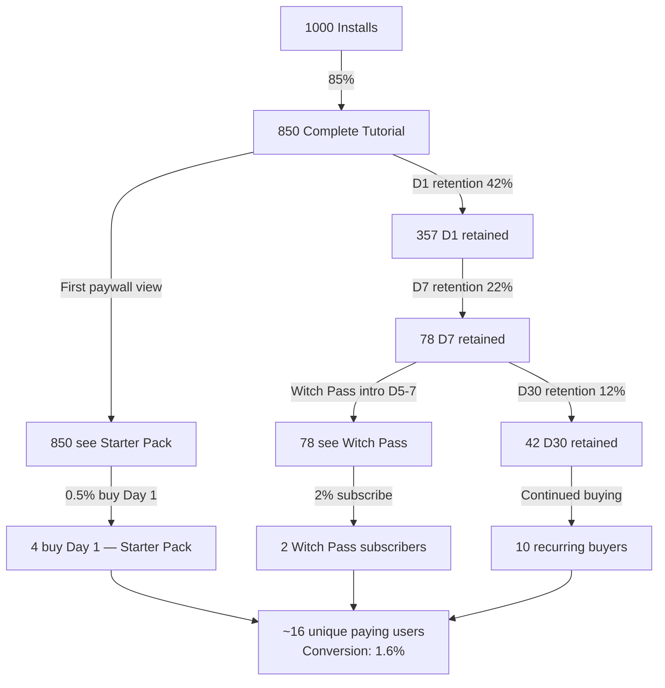
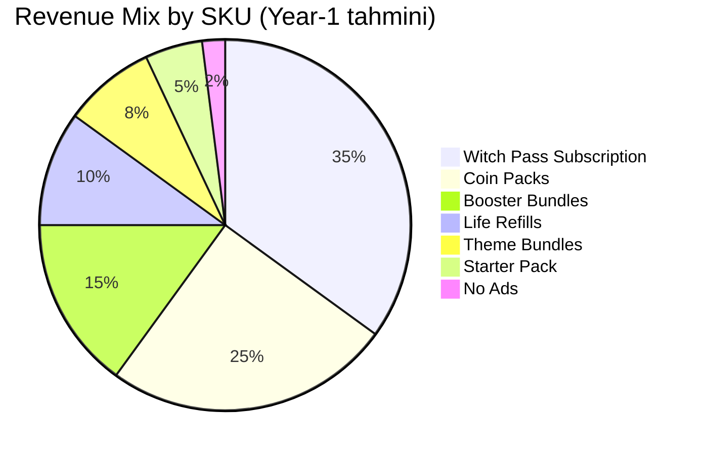
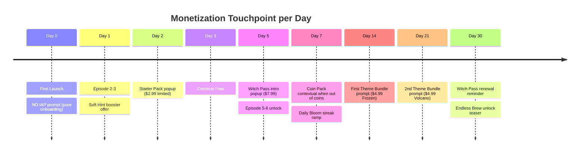
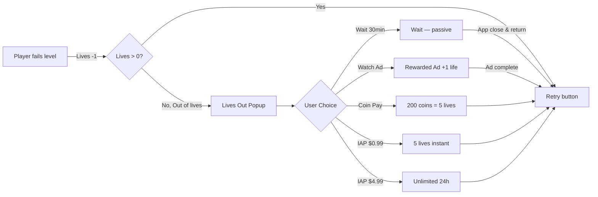
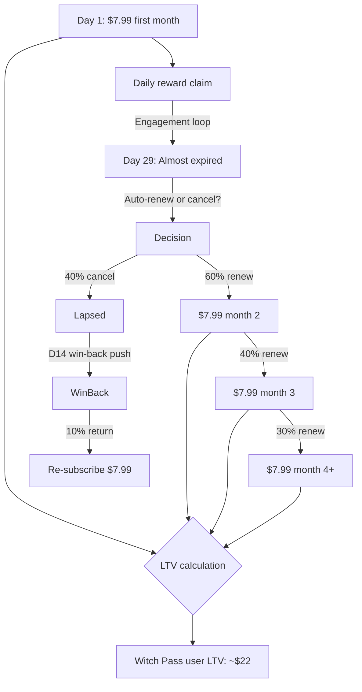
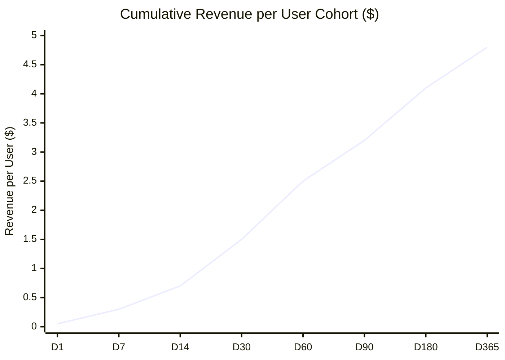
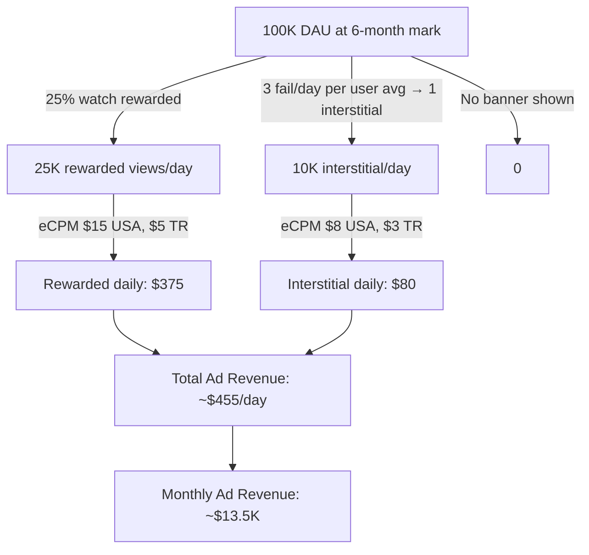
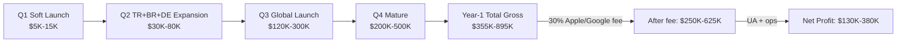
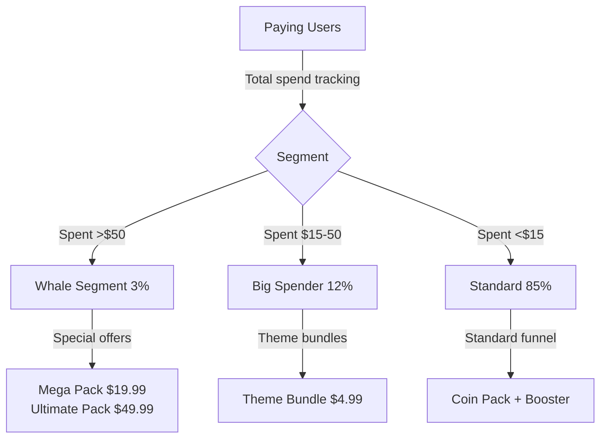

# 💸 Monetization Funnel

**Belge amacı**: Free → paying user dönüşüm haritası, SKU economy, LTV hesaplama.

---

## 1. Conversion Funnel (1000 install örneği)



Real-world tahmini: %1.6–%3.5 conversion (Royal Match level %3.5).

---

## 2. SKU-Bazlı Revenue Mix



---

## 3. ARPPU Distribution (Paying Users Segment)

```mermaid
xychart-beta
    title "ARPPU Distribution (Paying Users)"
    x-axis [Whale_$50+, Big_$15-50, Mid_$5-15, Small_$1-5]
    y-axis "% of Paying Users" 0 --> 60
    bar [3, 12, 35, 50]
```

- Small spenders (50%): $1-5 (Life Refill, single Booster Bundle)
- Mid spenders (35%): $5-15 (Witch Pass + 1 Theme Bundle)
- Big spenders (12%): $15-50 (Multiple Witch Pass renewals + Coin Packs)
- Whales (3%): $50+ (All themes + premium coins + Witch Pass loyal)

Average ARPPU: ~$12.

---

## 4. Touchpoint Timeline



---

## 5. Hayat (Lives) Conversion Loop



Tahmini split (out-of-lives moment):
- Wait: 60%
- Watch ad: 25%
- Coin pay: 10%
- IAP: 5% (1.5% IAP $0.99 + 0.5% IAP $4.99)

---

## 6. Witch Pass Lifetime Value



Witch Pass LTV: $7.99 × 1 + (60% × $7.99) + (40% × 60% × $7.99) + ... = ~$22.

---

## 7. Cohort Revenue Curve



LTV target: $4.50–5.00 per install (USA market). Türkiye/Brezilya proxy: ~$1.50.

---

## 8. Ad Revenue Funnel



---

## 9. Total Year-1 Revenue Tahmini



---

## 10. Whale Identification Pipeline



POURLE'de aggressive whale targeting yok — fair-play ethos. Whale segment doğal organic.

---

## 11. Monetization Health Metrics

| Metrik | Hedef | Kötü sınır | Aksiyon eğer kötü |
|---|---|---|---|
| Conversion rate | %2+ | %1- | Starter Pack ara timing |
| ARPDAU | $0.10+ | $0.05- | Reklam frequency arttır |
| ARPPU | $10+ | $5- | Witch Pass değer arttır |
| LTV | $4.50+ | $2- | UA budget cut, organic dominant |
| CPI break-even | <$3 | >$5 | Targeting daralt |
| Witch Pass renewal | 60%+ | 40%- | Premium track ödül arttır |

---

## 12. Pricing Sensitivity Test (A/B)

Soft launch sırasında test:

| Test | Variant A | Variant B | Winner ölçütü |
|---|---|---|---|
| Starter Pack | $2.99 | $1.99 | Daha yüksek revenue |
| Witch Pass | $7.99/mo | $4.99/mo | Subscriber rate × ARPPU |
| Coin Pack small | $0.99 = 200 | $0.99 = 300 | Conversion rate |
| Theme Bundle | $4.99 each | 3 themes for $9.99 | Bundle uplift |

A/B test framework: Firebase Remote Config + Analytics cohort split.

---

*Sürüm 1.0 — design freeze.*
