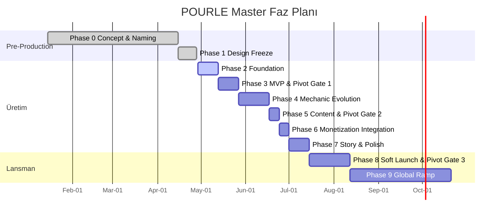
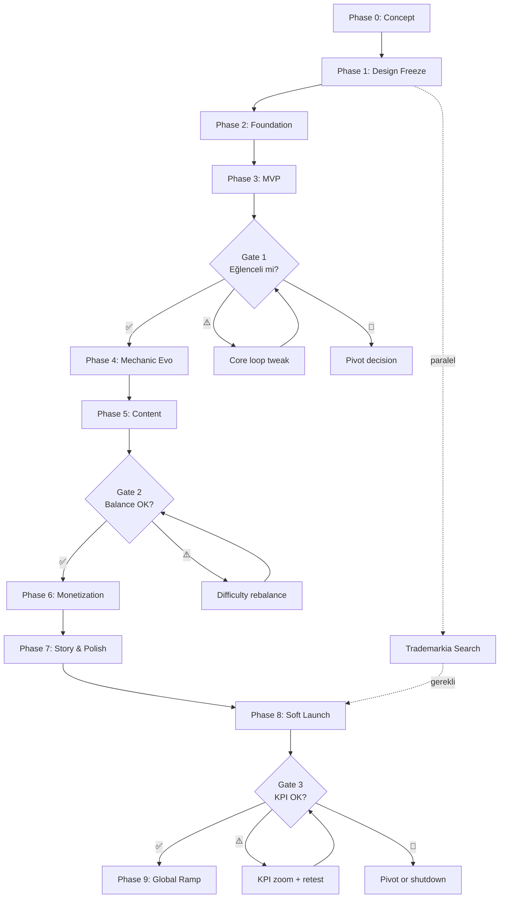

# 🗺️ 00 — Phase Plan (Code'a Başlamadan Önce Master Roadmap)

**Belge amacı**: POURLE'nin tüm yaşam döngüsünü 9 faza ayıran üst-düzey yol haritası. `09-production-plan.md` hafta-hafta detay verir; bu doküman fazlar arası bağımlılıkları, giriş/çıkış kriterlerini, pivot kapılarını ve karar noktalarını gösterir.

**Tarih**: 2026-04-28
**Durum**: Phase 0 ve Phase 1 tamamlandı, Phase 2 başlamak üzere
**Toplam süre**: 26 hafta (12 hafta üretim + 4 hafta soft launch + 10 hafta global ramp)

---

## 1. Faz Genel Bakış

| # | Faz | Süre | Pivot Gate | Durum |
|---|---|---|---|---|
| 0 | Concept & Naming | 12 hafta | — | ✅ Tamamlandı |
| 1 | Design Freeze | 2 hafta | — | ✅ Tamamlandı |
| 2 | Foundation (Unity setup + core logic) | 2 hafta | — | ⏳ Sonraki |
| 3 | MVP Build | 2 hafta | **Gate 1: Eğlenceli mi?** | ⏳ |
| 4 | Mechanic Evolution | 3 hafta | — | ⏳ |
| 5 | Content & Balance | 1 hafta | **Gate 2: Balance OK mı?** | ⏳ |
| 6 | Monetization Integration | 1 hafta | — | ⏳ |
| 7 | Story & Polish | 2 hafta | — | ⏳ |
| 8 | Soft Launch | 4 hafta | **Gate 3: KPI hedefte mi?** | ⏳ |
| 9 | Global Ramp | 10 hafta | — | ⏳ |

---

## 2. Phase 0 — Concept & Naming ✅

**Süre**: 12 hafta (Ocak–Nisan 2026)
**Çıktı**: 5 oyun konsepti şartlanması, v4 simülasyon framework'ü, isim doğrulama.

### Tamamlanan görevler
- ✅ 5 farklı casual puzzle konsepti taslak
- ✅ 4 pazar × 100 persona simülasyon (400 toplam)
- ✅ POURLE konsepti seçimi (v4 score 4.50)
- ✅ 8 isim adayı eleme
- ✅ POURLE manuel marka taraması (clean)
- ✅ Hedef kitle tanımı (22–55, 50/50 gender, mass-market global)

### Dosya çıktıları
- Eski prototipler temizlendi (`lastpeg/`, `pawsome-blast-prototype/` silindi)

---

## 3. Phase 1 — Design Freeze ✅

**Süre**: 2 hafta (15–28 Nisan 2026)
**Çıktı**: 30 dokümanlık donmuş tasarım paketi.

### Tamamlanan görevler
- ✅ Master GDD (`01-game-design-document.md`)
- ✅ Mekanikler (`02-mechanics.md`)
- ✅ Saga meta (`03-saga-meta.md`)
- ✅ Karakter bibles (`04-characters.md`)
- ✅ 6 chapter senaryoları (`05-story-scenarios.md`)
- ✅ Mekanik evrim çizelgesi (`06-mechanic-evolution.md`)
- ✅ Monetizasyon (`07-monetization.md`)
- ✅ Görsel stil rehberi (`08-visual-style.md`)
- ✅ 12 haftalık üretim planı (`09-production-plan.md`)
- ✅ Soft launch stratejisi (`10-soft-launch-strategy.md`)
- ✅ Risk + pivot gates (`11-risk-mitigation.md`)
- ✅ 13 art prompt (marketing, banner, 3 karakter, 6 sahne, 3 icon)
- ✅ 3 Mermaid diagram (architecture, chapter-flow, monetization-funnel)
- ✅ Cross-doc tutarlılık denetimi (3 tutarsızlık düzeltildi)

### Çıkış kriterleri (hepsi geçti)
- [x] Tüm tasarım kararları frozen-state
- [x] Visual style guide STRICT NO-GO list yayınlanmış
- [x] 3-soru karar filtresi + v4 simülasyon metodolojisi belgelenmiş
- [x] CLAUDE.md ile AI agent operating rules

---

## 4. Phase 2 — Foundation ⏳ (Sonraki: Hafta 1–2)

**Süre**: 2 hafta
**Hedef**: Compile-eden boş Unity projesi + tüm core logic + unit testler.

### Görevler
- [ ] Unity 6 LTS proje oluştur
- [ ] Folder structure (`09-production-plan.md` §3.3)
- [ ] 8 ScriptableObject şeması (`ChapterSO`, `EpisodeSO`, `LevelSO`, `JarConfigSO`, `MechanicSO`, `BoosterSO`, `ThemeSO`, `CutsceneSO`)
- [ ] `Jar.cs`, `LiquidLayer.cs` data classes
- [ ] `BallSortValidator.cs` (pour legality)
- [ ] `WordValidator.cs` (sözlük lookup)
- [ ] `LevelController.cs` (game loop)
- [ ] BFS solver (optimal hamle hesaplama)
- [ ] NUnit tests — tüm logic için (target %80 coverage)

### Giriş kriterleri
- Phase 1 tamamen tamam, design frozen
- Trademarkia $99 search **başlatılmış** (paralel — sonuç Phase 4'e kadar bekleyebilir)

### Çıkış kriterleri
- [ ] Bootstrap scene açılıyor, hata yok
- [ ] 10 test seviyesi headless solver ile otomatik geçiyor
- [ ] Unit test pass oranı %100
- [ ] Pour algoritma + word validator integration test geçiyor

### Dış bağımlılıklar
- Unity 6 LTS lisansı (free tier yeterli)
- DOTween Asset Store satın al ($15)

---

## 5. Phase 3 — MVP Build ⏳ + 🚦 Pivot Gate 1

**Süre**: 2 hafta (Hafta 3–4)
**Hedef**: 5 oynanabilir seviye, tester feedback, "eğlenceli mi?" testi.

### Görevler
- [ ] Tap interaction (`InputController.cs`)
- [ ] Pour animation (DOTween parabolic)
- [ ] Liquid layer visual (sprite + shader)
- [ ] Letter rendering (TextMeshPro)
- [ ] İlk slot-machine peak moment
- [ ] 5 hand-designed level (Episode 1)
- [ ] Octave + Iris + Mochi placeholder portrait
- [ ] Basic UI: HUD, fail/win popup
- [ ] Android APK build → 5 arkadaş test

### Çıkış kriterleri
- [ ] APK çalışıyor, crash yok
- [ ] Tutorial-free 30 saniyede oyun anlaşılıyor
- [ ] Peak moment tatmin verici hissediyor (subjektif tester check)

### 🚦 Pivot Gate 1 — Eğlenceli mi?

| Sonuç | Aksiyon |
|---|---|
| 4–5/5 tester "eğlenceli" | ✅ Phase 4'e devam |
| 2–3/5 tester | ⚠️ 1 hafta core loop tweak (renk match yumuşat, peak moment güçlendir) |
| 0–1/5 tester | 🛑 Pivot kararı: ya core loop redesign ya da projeyi kapat |

**Karar deadline**: Hafta 4 sonu Pazar.

---

## 6. Phase 4 — Mechanic Evolution ⏳

**Süre**: 3 hafta (Hafta 5–7)
**Hedef**: Saga meta + tüm mekanik varyantlar.

### Hafta 5 — Saga Meta
- [ ] LifeManager (5 hayat, 30 dk yenilenme)
- [ ] ChapterMap UI
- [ ] Yıldız sistemi
- [ ] Coin economy
- [ ] Save/Load (JSON)

### Hafta 6 — Mekanik Set 1
- [ ] Color Transform (Episode 6)
- [ ] Locked Caps (Episode 8)
- [ ] Frozen Bottle (Episode 11)
- [ ] Heat Booster (Episode 12)

### Hafta 7 — Mekanik Set 2
- [ ] Metallic Letters (Episode 16)
- [ ] Lava Bottle (Episode 21)
- [ ] Cool Mist Booster (Episode 24)
- [ ] Cosmic Spells (Episode 26)
- [ ] Cascade dynamic (Episode 28)
- [ ] Bonus level formats (Speed Brew, No Hint, Master Word)

### Çıkış kriterleri
- [ ] 30 episode iskeletinin hepsi oynanabilir
- [ ] Tüm 12 mekanik state machine doğru çalışıyor

---

## 7. Phase 5 — Content & Balance ⏳ + 🚦 Pivot Gate 2

**Süre**: 1 hafta (Hafta 8)
**Hedef**: 150 level + difficulty curve doğrulaması.

### Görevler
- [ ] 30 hand-designed boss seviye
- [ ] 120 procedural seviye (BFS solver auto-validated)
- [ ] Star threshold ayarı (her seviye için)
- [ ] Difficulty curve check (oyuncu skill eğrisi monoton-NOT)
- [ ] Internal tester run (5 kişi)

### Çıkış kriterleri
- [ ] 150 level tamamı çözülebilir (BFS verification)
- [ ] Tester completion rate %70+
- [ ] Hint booster kullanım oranı %30 altında

### 🚦 Pivot Gate 2 — Balance OK mı?

| Sonuç | Aksiyon |
|---|---|
| ≥%70 completion | ✅ Phase 6'ya devam |
| %50–70 | ⚠️ 3 gün difficulty rebalance |
| <%50 | 🛑 1 hafta tutorial expansion + complexity reduce |

**Karar deadline**: Hafta 8 sonu Pazar.

---

## 8. Phase 6 — Monetization Integration ⏳

**Süre**: 1 hafta (Hafta 9)
**Hedef**: Tüm IAP + ad SDK çalışır halde.

### Görevler
- [ ] Unity IAP integration
- [ ] AdMob + AppLovin MAX waterfall
- [ ] 7 SKU + Witch Pass + Theme Bundle slot
- [ ] Sandbox satın alma testleri (Apple + Google)
- [ ] Receipt validation
- [ ] No Ads SKU davranışı doğrulama

### Çıkış kriterleri
- [ ] Tüm SKU sandbox'ta satın alınabiliyor
- [ ] Restore purchases çalışıyor (cihaz değişimi simülasyonu)
- [ ] Witch Pass auto-renew prompt görünüyor
- [ ] Rewarded ad tamamlandığında reward delivery doğru

---

## 9. Phase 7 — Story & Polish ⏳

**Süre**: 2 hafta (Hafta 10–11)
**Hedef**: Tüm cutscene, audio, haptik, performans optimize.

### Hafta 10 — Story
- [ ] 60 episode cutscene (giriş + final)
- [ ] 6 chapter cutscene
- [ ] Dialog text 10 dile lokalize (extraction-ready JSON)
- [ ] Cutscene player (skip-able)

### Hafta 11 — Audio + Final Polish
- [ ] 6 chapter müzik track
- [ ] 30+ unique SFX
- [ ] Haptic patterns (CoreHaptics + Niceft Vibrations)
- [ ] Crash sweep (target <%0.3)
- [ ] Performance profiling (60 fps mid-range Android)
- [ ] App icon final design (3 variant test ready)
- [ ] Store listing draft (8 screenshot + 30s promo video)

### Çıkış kriterleri
- [ ] Crash-free oturum oranı %99.5+
- [ ] iPhone 11 + Samsung A52'de 60 fps
- [ ] Build size <150 MB
- [ ] Tüm dil JSON dosyaları yüklenir, dialog typo yok

---

## 10. Phase 8 — Soft Launch ⏳ + 🚦 Pivot Gate 3

**Süre**: 4 hafta (Hafta 12–15)
**Hedef**: Türkiye + Brezilya + Almanya'da KPI doğrulaması.

### Hafta 12 — Lansman
- [ ] Apple App Store Connect listing live
- [ ] Google Play Console listing live
- [ ] Apple Search Ads $200 kampanya
- [ ] Meta Ads $250 kampanya
- [ ] TikTok organic content günlük

### Hafta 13–15 — İzleme & Tweak
- [ ] Günlük KPI dashboard takip
- [ ] Crash hotfix (24 saat reaction)
- [ ] Negative review reply
- [ ] A/B test creative iterate

### 🚦 Pivot Gate 3 — KPI hedefte mi?

| KPI | Hedef | Gerekli |
|---|---|---|
| D1 retention | %42+ | Gerekli |
| D7 retention | %22+ | Gerekli |
| Store rating | 4.5+ | Gerekli |
| Paying conversion | %2.0+ | Gerekli |
| Crash-free | %99.5+ | Gerekli |

| Skor | Aksiyon |
|---|---|
| 5/5 ✅ | Phase 9 global launch + UA $5K/ay |
| 4/5 ✅ | 2 hafta zayıf KPI'ı zoom + retest |
| 3/5 ✅ | 4 hafta polish + retest |
| 2/5 ✅ | 6 hafta refactor (core loop veya monetization) |
| 0–1/5 ✅ | 🛑 Pivot veya project shutdown |

**Karar deadline**: Hafta 15 sonu.

---

## 11. Phase 9 — Global Ramp ⏳

**Süre**: 10 hafta (Hafta 16–25)
**Hedef**: Global lansman + 1 yıl steady operasyon.

### Hafta 16–18: ABD launch
- ASO optimizasyon (keyword iteration)
- Apple Search Ads $1K/hafta
- Press kit gönderimi (Touch Arcade, Pocket Gamer)

### Hafta 19–21: Asya genişleme
- Japonya + Güney Kore lokalizasyon doğrulama
- UA $2K/hafta

### Hafta 22–25: Mature operasyon
- Aylık event cadence (Spring Brew, Halloween Brew, vb.)
- Co-op feature beta
- Witch Pass V2 iterate
- Phase 10 prep: 2. oyun konsept araştırma

### Year-1 hedefler
- 500K–2M MAU
- $130K–380K net kar
- Witch Pass 5K+ aktif aboneliği

---

## 12. Bağımlılık Haritası

---

## 13. Risk → Faz Eşlemesi

| Risk | İlgili Faz | Mitigasyon |
|---|---|---|
| Trademark POURLE clash | Phase 2 (paralel) | Trademarkia $99 search Hafta 1, fallback POPLET/MIXLE |
| Mekanik eğlenceli değil | Phase 3 Gate 1 | Pivot karar 1 hafta deadline |
| Balance bozuk | Phase 5 Gate 2 | BFS solver re-tune, 3 gün buffer |
| KPI hedefin altında | Phase 8 Gate 3 | 4 hafta polish penceresi |
| Solo developer burnout | Tüm fazlar | Pazar tatil zorunlu, hafta 6 buffer 2 gün |
| Crash rate >%2 | Phase 7–8 | Crashlytics + 24 saat hotfix protokolü |

Detay: `11-risk-mitigation.md`.

---

## 14. Bütçe Eşlemesi (Faz × $)

| Faz | Tahmini harcama |
|---|---|
| Phase 0–1 (tamam) | $0 (sadece zaman) |
| Phase 2 | $35 (DOTween + asset store) |
| Phase 3 | $50 (AI görsel test + Play Console $25) |
| Phase 4 | $70 (Niceft Vibrations + müzik test) |
| Phase 5 | $20 (tester ödülü) |
| Phase 6 | $99 (Apple Developer + sandbox test) |
| Phase 7 | $80 (müzik + SFX + AI görsel) |
| Phase 8 | $1,200 (UA $500 + lokalizasyon $300 + press $200 + buffer $200) |
| Phase 9 | $1,300 (UA scale, mature ops) |
| Trademarkia | $99 (Phase 2 paralel) |
| **Toplam** | **~$2,953** ($3,000 budget içinde) |

---

## 15. Bu Belgenin Kullanımı

- **Solo developer (sen)**: Her Pazar günü açıp ilerleme check.
- **Future Claude agent**: "Hangi fazdayız?" sorusuna referans.
- **External collaborator (Phase 2 ileri)**: Onboarding doc.
- **Investor pitch (Phase 9 ileri)**: Roadmap görselleştirme.

### Faz değişikliği prosedürü
1. Bir fazın deadline'ı kaçırılırsa: `11-risk-mitigation.md` buffer kullanım sırası.
2. Pivot Gate'te red bayrak: Bu dokümana **revizyon tarihi + karar notu** eklenir.
3. Yeni faz eklenmesi: 3-soru filtresi + design sahibi onayı (`CLAUDE.md`).

---

## 16. Bağlantılı Belgeler

- **Hafta-hafta detay**: [`09-production-plan.md`](09-production-plan.md)
- **Risk + pivot mantığı**: [`11-risk-mitigation.md`](11-risk-mitigation.md)
- **Soft launch stratejisi**: [`10-soft-launch-strategy.md`](10-soft-launch-strategy.md)
- **Master GDD**: [`01-game-design-document.md`](01-game-design-document.md)

---

*Sürüm 1.0 — design freeze tamamlandı, Phase 2 sonraki hedef. Üretim öncesi son master plan.*
